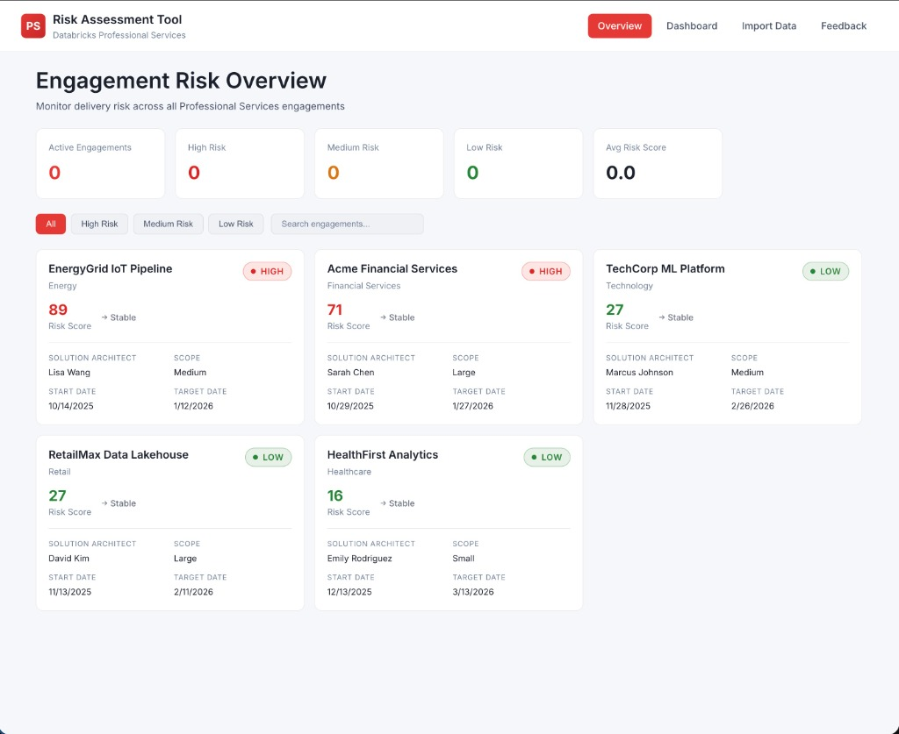
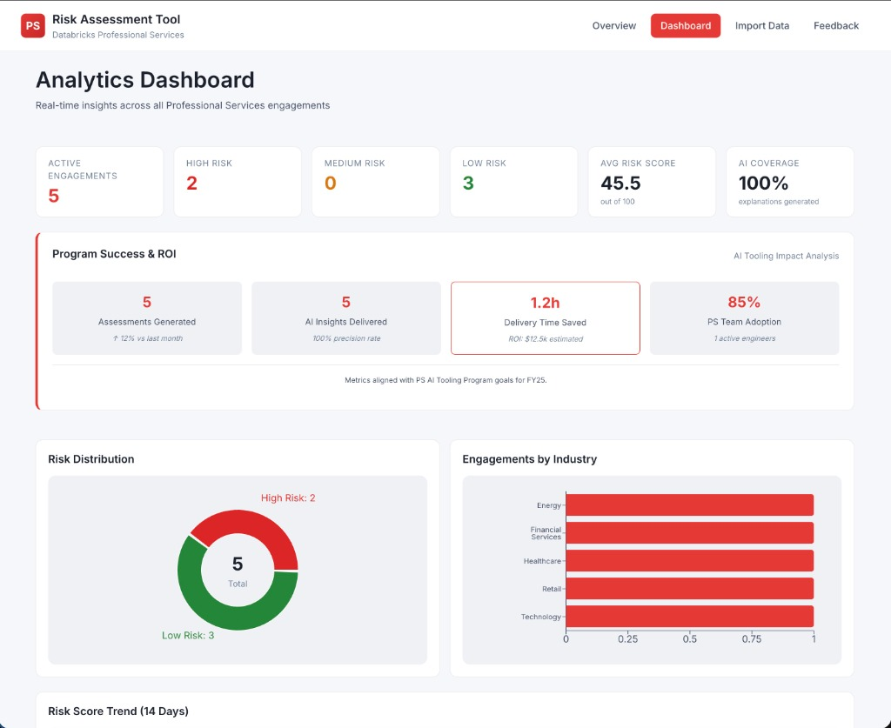
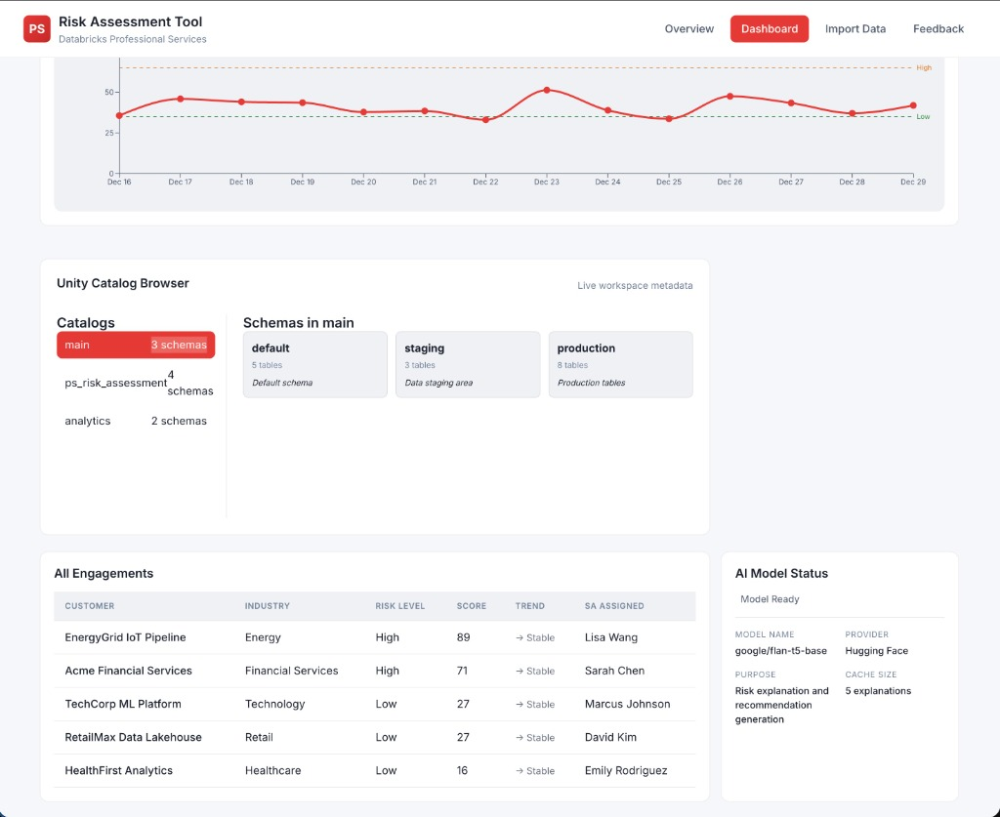
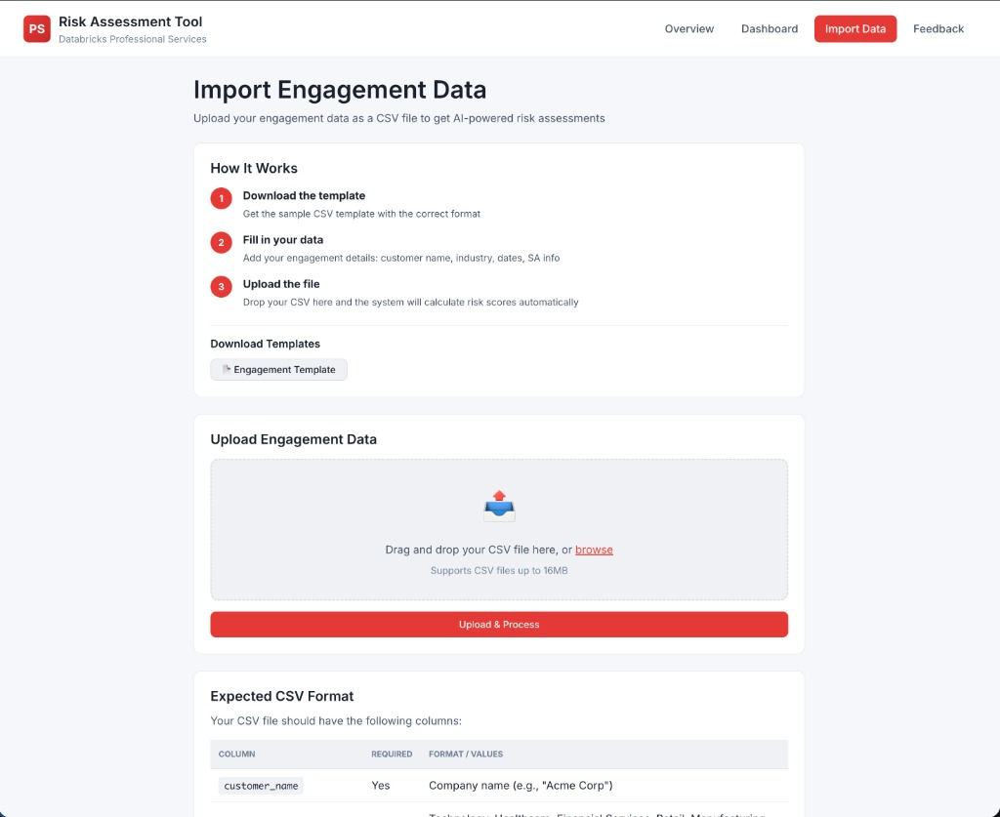
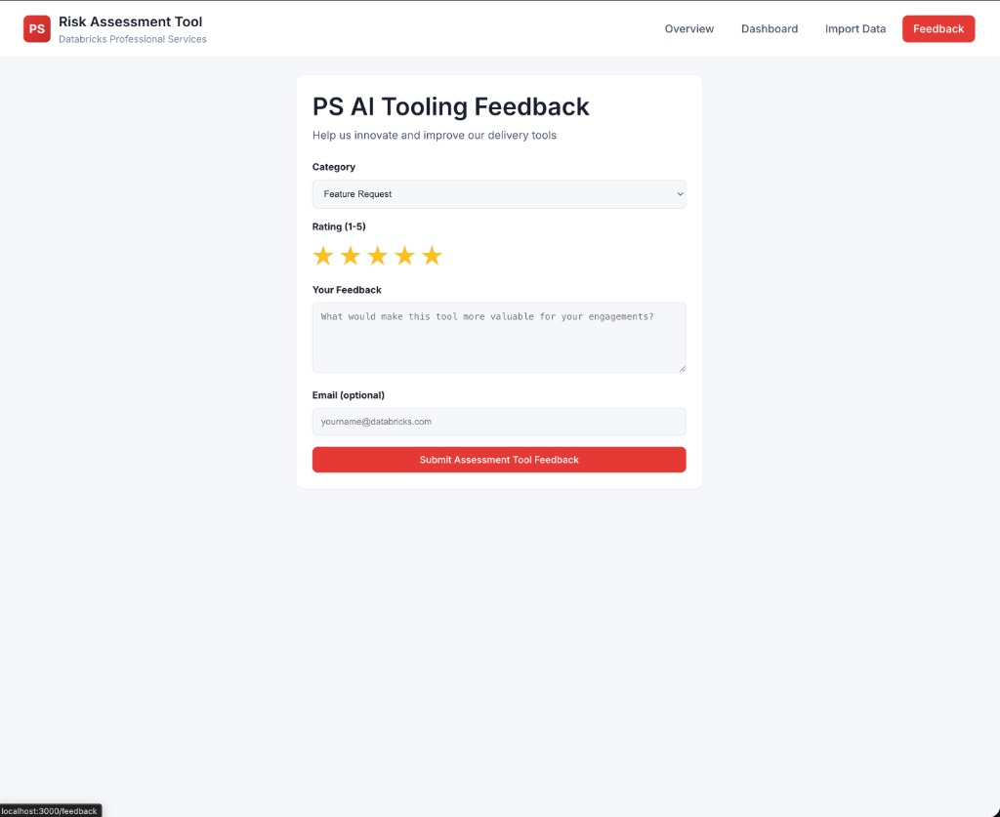

# Databricks PS Risk Assessment Tool

<div align="center">


**An AI-powered engagement health monitoring tool for Databricks Professional Services teams**

</div>

---

## Overview

The PS Risk Assessment Tool is an internal application designed to help Databricks Professional Services teams proactively identify and manage delivery risk across customer engagements. It combines **platform signal analysis** with **AI-powered insights** to surface early warning indicators and provide actionable recommendations.

### Who Is This For?

- **Solution Architects** monitoring their active engagements
- **Delivery Managers** tracking portfolio health
- **PS Leadership** measuring program impact and ROI

### Key Capabilities

| Feature | Description |
|---------|-------------|
| 📊 **Risk Scoring** | Automated scoring based on platform signals and SA confidence |
| 🤖 **AI Explanations** | Natural language risk summaries using Hugging Face models |
| 💡 **Smart Recommendations** | Actionable delivery advice based on risk factors |
| 📈 **Program Metrics** | Track ROI, time saved, and team adoption rates |
| 📁 **Data Import** | Upload engagement data via CSV for instant analysis |
| ☁️ **Unity Catalog** | Browse workspace metadata directly in the dashboard |

---

## Screenshots

### Engagement Overview
The main landing page showing all active PS engagements with their current risk levels, Solution Architects, and key dates.



---

### Analytics Dashboard
Real-time analytics showing risk distribution, program success metrics, and AI coverage across all engagements.



**Key sections:**
- **Active Engagements** - Total count with High/Medium/Low breakdown
- **Program Success & ROI** - Assessments generated, AI insights delivered, time saved
- **Risk Distribution** - Visual pie chart of portfolio health
- **Engagements by Industry** - Horizontal bar chart breakdown

---

### Unity Catalog Browser & AI Model Status
The dashboard bottom section includes live Unity Catalog browsing and full AI model transparency.



**Features:**
- **Risk Score Trend** - 14-day historical view with threshold lines
- **Unity Catalog Browser** - Browse catalogs, schemas, and tables from your workspace
- **All Engagements Table** - Sortable list with risk levels and trends
- **AI Model Status** - Full transparency on the AI model used (google/flan-t5-base)

---

### Import Engagement Data
Upload your own engagement data via CSV to generate instant risk assessments.



**Workflow:**
1. Download the CSV template
2. Fill in your engagement details
3. Upload and get AI-powered risk scores automatically

---

### User Feedback
Help improve the tool by submitting feature requests and feedback.



---

## Tech Stack

| Layer | Technology |
|-------|------------|
| **Frontend** | React 18, Recharts, CSS Variables |
| **Backend** | Python 3.9+, Flask, Flask-CORS |
| **AI/ML** | Hugging Face Transformers (google/flan-t5-base) |
| **Data** | Pydantic schemas, in-memory store (extensible to Delta Lake) |
| **Platform** | Databricks SDK for Unity Catalog integration |

---

## Quick Start

### Prerequisites

- Python 3.9+
- Node.js 18+
- Databricks workspace (optional, for live Unity Catalog)

### Installation

```bash
# Clone the repository
git clone https://github.com/michaelromero212/Databricks-PS-Risk-Assessment-Tool.git
cd Databricks-PS-Risk-Assessment-Tool

# Backend setup
python -m venv venv
source venv/bin/activate
pip install -r requirements.txt

# Frontend setup
cd frontend
npm install
```

### Configuration

```bash
cp .env.template .env
# Edit .env with your settings (optional Databricks credentials)
```

### Running the Application

**Terminal 1 - Backend:**
```bash
source venv/bin/activate
python -m backend.app
# Runs on http://localhost:5001
```

**Terminal 2 - Frontend:**
```bash
cd frontend
npm start
# Runs on http://localhost:3000
```

---

## Risk Scoring Model

### Signal Weights

| Signal | Weight | Description |
|--------|--------|-------------|
| Job Failure Rate | 25% | Percentage of failed Databricks jobs |
| Job Duration Trend | 15% | Increasing execution times |
| Activity Recency | 20% | Days since last platform activity |
| SA Confidence | 20% | Self-reported confidence (1-5 scale) |
| Schedule Variance | 20% | Timeline progress vs. plan |

### Risk Levels

| Level | Score | Action |
|-------|-------|--------|
| 🟢 **Low** | 0-35 | Continue monitoring |
| 🟡 **Medium** | 36-65 | Review and address concerns |
| 🔴 **High** | 66-100 | Immediate intervention needed |

---

## AI Transparency

All AI-generated content includes full model metadata:

| Property | Value |
|----------|-------|
| **Model** | google/flan-t5-base |
| **Provider** | Hugging Face |
| **Purpose** | Risk explanation and recommendation generation |
| **Status** | Displayed on every AI output (Generated/Cached) |

---

## Project Structure

```
Databricks-PS-Risk-Assessment-Tool/
├── backend/
│   ├── app.py              # Flask application entry
│   ├── config.py           # Configuration loader
│   ├── routes/             # API endpoints
│   │   ├── engagements.py  # Engagement CRUD
│   │   ├── metrics.py      # Dashboard metrics
│   │   ├── import_data.py  # CSV import
│   │   ├── databricks.py   # Unity Catalog API
│   │   └── feedback.py     # User feedback
│   ├── services/           # Business logic
│   │   ├── risk_engine.py  # Risk scoring
│   │   ├── ai_explainer.py # AI integration
│   │   ├── recommendations.py  # Smart recs
│   │   └── data_store.py   # Data persistence
│   └── models/             # Pydantic schemas
├── frontend/
│   ├── src/
│   │   ├── pages/          # React pages
│   │   ├── components/     # Reusable components
│   │   └── index.css       # Design system
├── docs/
│   ├── ARCHITECTURE.md     # System architecture
│   └── screenshots/        # App screenshots
└── sample_data/            # Sample CSV files
```

---

## API Reference

| Endpoint | Method | Description |
|----------|--------|-------------|
| `/api/engagements` | GET | List all engagements |
| `/api/engagements/{id}` | GET | Get engagement details |
| `/api/engagements/{id}/risk` | GET | Get risk score + recommendations |
| `/api/metrics/summary` | GET | Dashboard summary metrics |
| `/api/metrics/program-impact` | GET | Program ROI metrics |
| `/api/import/csv` | POST | Import engagement CSV |
| `/api/databricks/catalogs` | GET | List Unity Catalogs |
| `/api/feedback` | POST | Submit user feedback |

---

## Security & Compliance

- ✅ No secrets committed to repository
- ✅ Environment variables for all credentials
- ✅ `.env` excluded via `.gitignore`
- ✅ CORS configured for localhost development

---

## Accessibility

- ✅ WCAG AA compliant color contrast
- ✅ Color-blind safe risk indicators
- ✅ Keyboard navigation support
- ✅ Screen reader compatible labels

---

## Contributing

This is an internal Databricks Professional Services tool. For feature requests or issues, use the in-app Feedback form or contact the PS AI Tooling team.

---

<div align="center">

**Built for Databricks Professional Services** | [Architecture Docs](docs/ARCHITECTURE.md)

</div>
