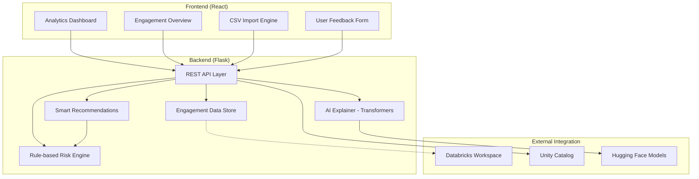

# System Architecture - PS Risk Assessment Tool

This document outlines the technical architecture of the AI-powered Risk Assessment Tool, designed for the Databricks Professional Services (PS) organization.

## High-Level Architecture

The system follows a modern web application architecture combining a React frontend, a Flask backend, and integration with the Databricks Data Intelligence Platform.

## Core Components

### 1. Risk Scoring Engine (`risk_engine.py`)
- Implements rule-based heuristics for engagement health.
- Aggregates platform signals (job failures, activity recency, etc.) with SA confidence scores.
- Standardizes risk into High, Medium, and Low categories.

### 2. AI Explainer (`ai_explainer.py`)
- Leverages Hugging Face Transformers (`google/flan-t5-base`) to generate natural language explanations.
- Translates raw risk scores and factors into readable insights for stakeholders.

### 3. PS Program Impact (`metrics.py`)
- Tracks tool adoption, assessments generated, and estimated time saved.
- Provides PS Leadership with ROI metrics on the AI Tooling program.

### 4. Databricks Integration (`databricks_client.py`)
- Directly connects to Databricks Workspaces via the official SDK.
- Surfaces Unity Catalog metadata (catalogs, schemas) to demonstrate platform awareness.

## Data Flow: Engagement Import

1. **Upload**: User uploads CSV to the Import Engine.
2. **Processing**: Backend validates data and generates simulated 14-day platform signals.
3. **Scoring**: Risk Engine computes the initial health score.
4. **Enrichment**: AI Explainer generates a detailed risk summary.
5. **Action**: Smart Recommendation Engine provides delivery advice.
6. **Persistence**: Results are stored in the local data store (extensible to Delta Lake).
